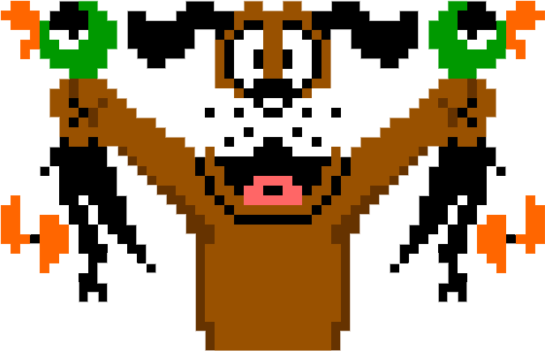
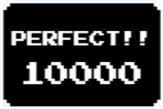

  
  <h3 align="center">Duck Hunt</h3>
  

    <a href="https://adi52.github.io/duck-hunt/build/index.html"><strong>View a Demo »</strong></a>
  

## Table of contents
* [General info](#general-info)
  * [Game play](#game-play)
  * [Win condition](#win-condition)
  * [Points](#points)
  * [Perfect score](#perfect-score)
  * [Controllers](#controllers)
* [Availability](#availability)
* [Technologies](#technologies)
* [Setup](#setup)
* [Status](#status)
* [Inspiration](#inspiration)
* [Screenshots](#screenshots)
* [Contact](#contact)

## General info
This is the cult 80’s game recreated by me and transferred to the internet browser.

### Game play :video_game:

We observe the game from the shooter's perspective, and our task is to hit the ducks, which are flying out of the bushes. 
The game is divided into rounds in which we have 10 sub-rounds. Each round starts with an intro in which our assistant 
(or enemy number 1 :smiling_imp:) the dog chases away the ducks which are hiding in the bushes. During each sub-round, we have 3 shots. 
If all of them are missed or a certain time passes - the duck flies away and we lose the sub-round. The lost sub-round is represented 
by the bar at the bottom of the screen and the hated laugh of our dog friend :smiling_imp:. A red duck icon marks the target 
hit. For each target hit, we get points, and if we hit all 10 targets, we get an additional reward in the form of a 
bonus number of points (Perfect!).

As the rounds progress, the difficulty level increases, the ducks fly faster and faster, and we have less time to hit 
the target.

### Win condition :star:

To go to the next round, we have to hit a certain number of ducks in the current round. These conditions are shown below:
* Round 1 – 3	
  * you must hit 7 out of 10 ducks
* Round 4 – 6	
  * you must hit 8 out of 10 ducks
* Round 7 - 10	
  * you need to hit 9 out of 10 ducks
* Round 10 – up	
  * you have to hit 10 out of 10 ducks

If you do not meet the above condition, you lose the round, the dog laughs at you and then you are moved to the main 
menu, where you can start the game again from the 1st round.

### Points :money_with_wings:

During each sub-round, one of the three ducks (Black, Red, and Blue) will be randomly respawned. For each of them, based 
on the round, you can receive a different number of points.
* Round 1 - 3
  * Black duck: 500
  * Red duck: 1000
  * Blue Duck: 1500
* Round 4 - 6
  * Black duck: 800
  * Red duck: 1600
  * Blue Duck: 2400
* Round 7 – Up
  * Black duck: 1000
  * Red Duck: 2000
  * Blue Duck: 3000

### Perfect score

  

If you get `Perfect!` At the end of the round you will get extra points:
 * Round 1 - 3    
   * 10000 points
 * Round 4 - 6    
   * 15000 points
 * Round 7 - 10
   * 20000 points
 * Round 11 - up
   * 30000 points

### Controllers

All you need to play is the mouse with will you can shoot.
The Escape key enables and disables paused.

### Sounds :notes:

  

All sounds came from the original Duck Hunt game. Below the window game there is a volume
panel where you can turn the sound down / up or off completely.

## Availability :computer:

The game is suitable only for desktop devices equipped with a mouse. There is no version for mobile devices.

## Technologies

The game was written entirely in HTML5 Canvas and Javascript.

- HTML5 canvas
- JavaScript ES6
- Sass
- Webpack

## Setup

Live version: [live](https://adi52.github.io/duck-hunt/build/index.html)

Clone repo: 

`git clone https://github.com/Adi52/DuckHunt.git`

Install the dependencies:

`npm install`

Run dev server:

`npm start`

Type in the browser:  

`http://localhost:5001`

## Status
Project is: `finished`. I don’t plan to expand this game, only a fix for bugs found.

## Inspiration

I was inspired to write this game by desire to discover the power of HTML5 Canvas. After doing the first animations in 
canvas, I decided to try to write a retro game. Duck Hunt was chosen because of childhood memories.

## Screenshots

  

## Contact
Created by [bielinski.dev](https://github.com/adi52) - feel free to contact me!
